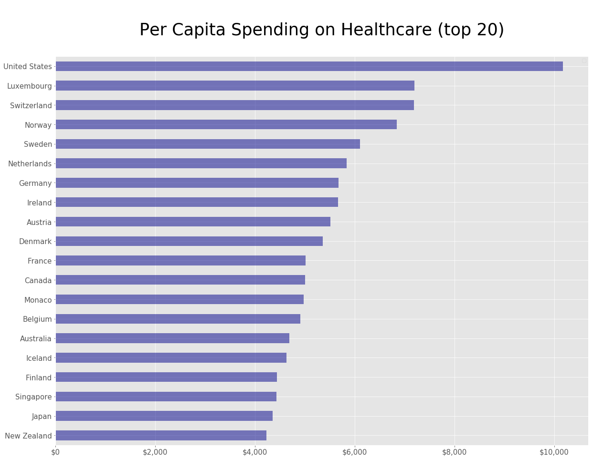
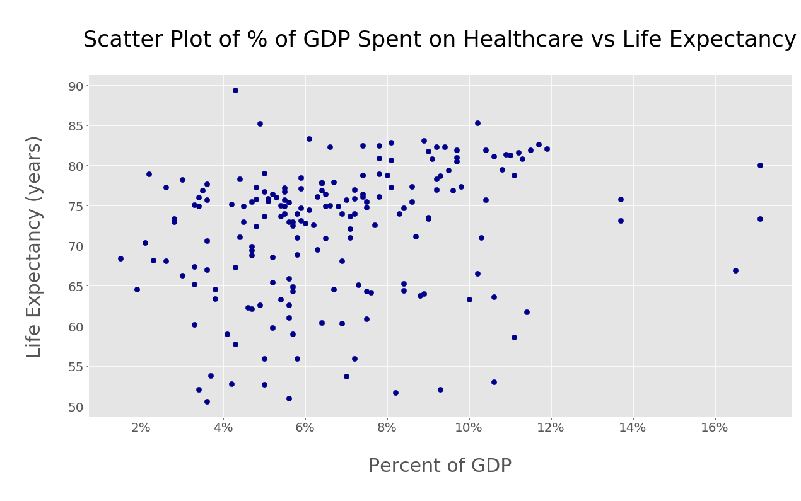
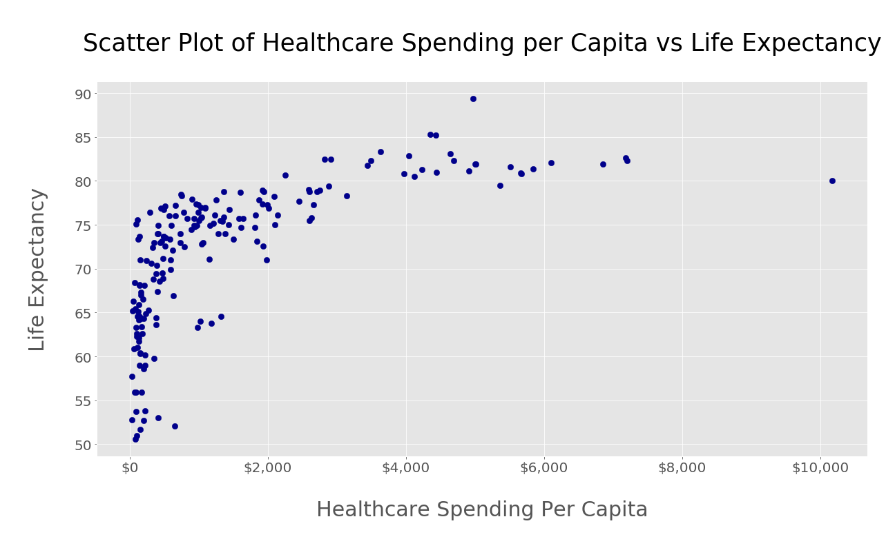
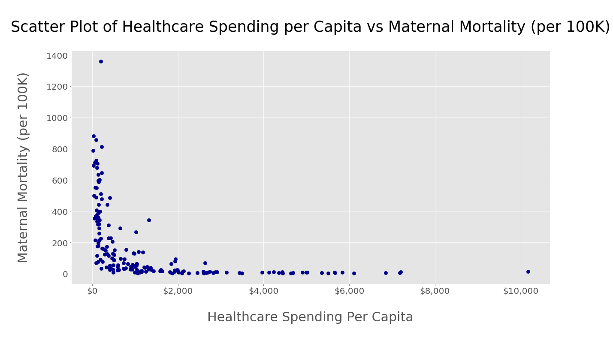
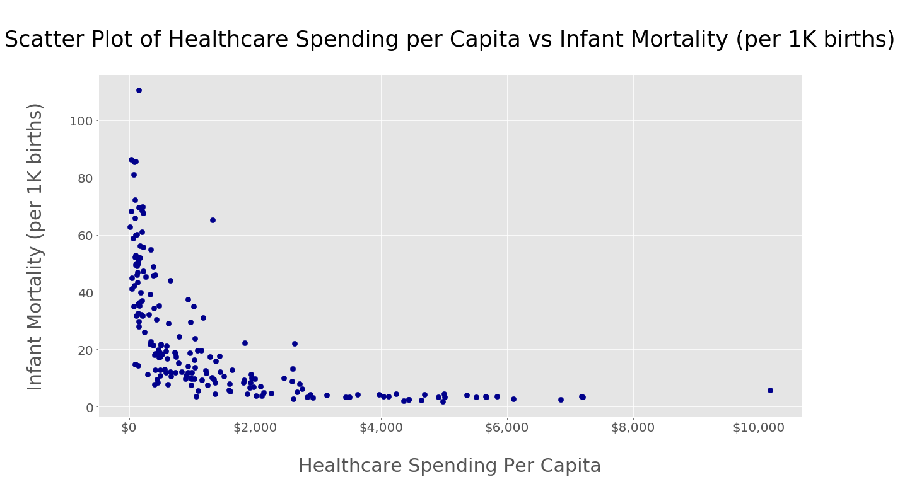

## Healthcare Cost Analysis


"You get what you pay for."  The underlying assumption of this well known idiom suggests that when a product costs more, it has a higher value.  In this [Jupyter Notebook](Healthcare_Spending_and_Outcomes.ipynb), we explore the validity of this idiom with regards to healthcare spending.  In other words, does increased healthcare spending result in better health outcomes?  To examine this question, we will draw upon data supplied by the CIA's [World Factbook](https://www.cia.gov/library/publications/the-world-factbook/rankorder/rankorderguide.html).

## Installation

For those interested in cloning the repository and running the scripts, the [requirements.txt](requirements.txt) file is included. As is customary, the following shell command will ensure the necessary packages are installed to a local virtual environment.  

```
pip install -r requirements.txt
``` 

## Data

The CIA's [World Factbook](https://www.cia.gov/library/publications/the-world-factbook/rankorder/rankorderguide.html) site provides raw data in plaintext form.  Each of the data files used in this analysis has 3 columns separated by a variable number of tabs.  The 3 columns represent the rank order for the measurement of interest, the country, and the measurement.  Some of the measurements require some clean-up before they can be used (dollar figures in string form with dollar signs and commas for [example](data/gdp_per_capita.txt)).  When loading these files into dataframes the first column (rank order) is ignored.

## Figures/Data Exploration

Perhaps a visual examination of the data is most helpful to most rapidly gain useful insights.  For perspective, a plot of the top 20 healthcare spenders per capita is illustrated below.  



Visualization of the scatter plot of the percentage of GDP spent on healthcare vs life expectancy argues against a strong correlation between the 2 values.  Each dot represents a single country.



There appears to be some relationship between per capita healthcare spending and life expectancy based upon the following scatter plot (again, each dot represents a single country).  However the relationship does not appear linear and there appears to be a value of annual per capita healthcare spending above which there is no correlation with a longer life expectancy (around $2,750).



Visualization of a scatter plot of per capita healthcare spending and maternal mortality similarly appears to demonstrate a non-linear relationship above which a lower maternal mortality does not appear to be correlated (around \$2,650).



The scatter plot of per capita healthcare spending and infant mortality appears somewhat similar to that of the plot for maternal mortality.  Likewise, there is a similar value of per capita GDP above which improvements in infant mortality do not appear to be correlated (\$2,725).



## Conclusion

For each of the 3 most commonly used measurements of health outcomes (life expectancy, maternal mortality and infant mortality) a simple linear relationship between a country's annual per capita healthcare spending and a better health outcome does not appear to exist.  The annual per capita healthcare spending above which better outcomes do not appear to be correlated lies between \$2,650 and \$2,750.  For reference, the US spends over \$10,000 annually per capita on healthcare.  These findings should at least provoke some thought when making policy decisions regarding healthcare spending in the United States.
